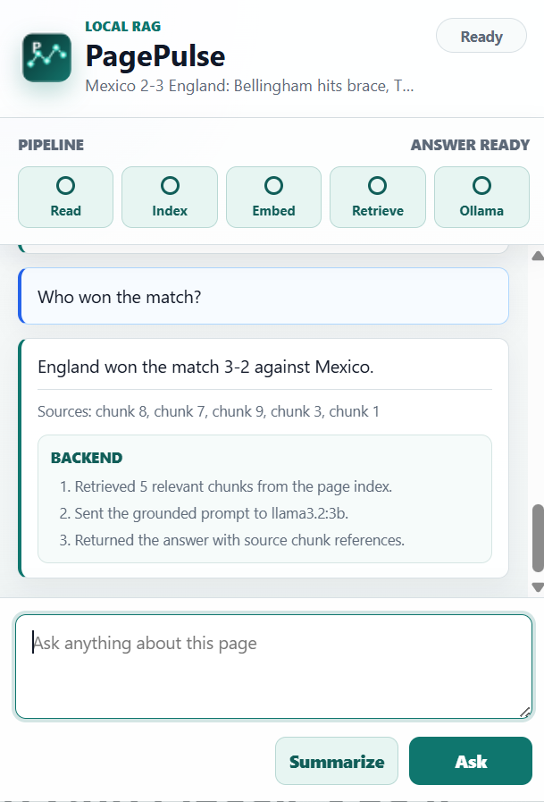
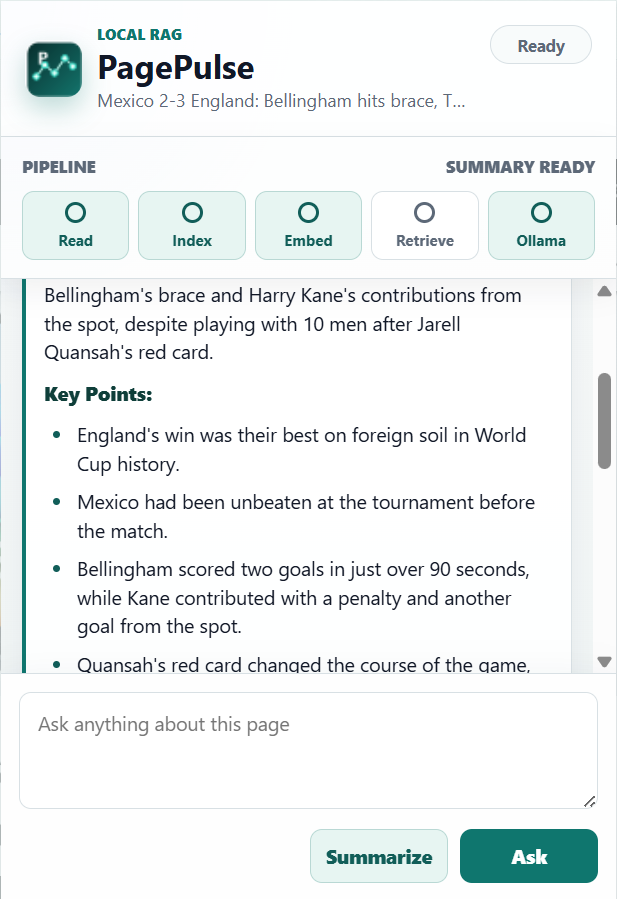
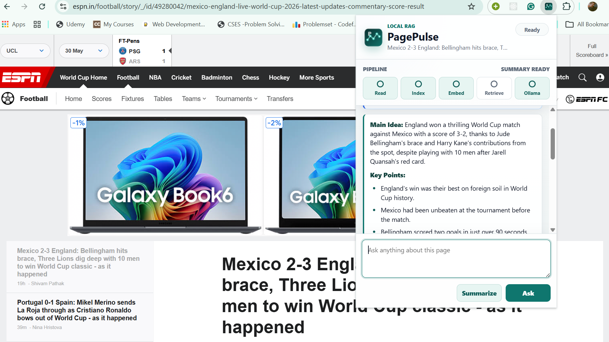

# PagePulse

PagePulse is an AI-powered Chrome extension for webpage Q&A and summarization. It uses a local RAG backend with FastAPI, LangChain, Ollama, `llama3.2:3b`, and `nomic-embed-text`, so page content stays on your machine.

This project is local-only. The extension calls the backend at `http://127.0.0.1:8001`, and the backend calls Ollama at `http://127.0.0.1:11434`.

## Dashboard

| Q&A | Summary | Browser View |
|---|---|---|
|  |  |  |

## Tech Stack

- Chrome Extension MV3
- FastAPI
- LangChain
- Ollama
- Chat model: `llama3.2:3b`
- Embedding model: `nomic-embed-text`
- Vector store: `InMemoryVectorStore`
- Splitter: `RecursiveCharacterTextSplitter`

## Prerequisites

- Google Chrome
- Python 3.10+
- Ollama: https://ollama.com/download

## Run The Project

### 1. Load The Chrome Extension

Open Chrome and go to:

```text
chrome://extensions
```

Enable `Developer mode`, click `Load unpacked`, and select:

```text
C:\webpage-rag-extension-ollama\extension
```

### 2. Start Ollama

Check installed models:

```powershell
ollama list
```

If needed, pull the required models:

```powershell
ollama pull llama3.2:3b
ollama pull nomic-embed-text
```

Start Ollama:

```powershell
ollama serve
```

Keep this terminal open. If Ollama is already running, this may say the port is already in use.

### 3. Start Backend

Open a new PowerShell window:

```powershell
cd "C:\webpage-rag-extension-ollama"
py -m venv .venv
.\.venv\Scripts\python.exe -m pip install -U pip
.\.venv\Scripts\python.exe -m pip install -r .\backend\requirements.txt
.\.venv\Scripts\python.exe -m uvicorn app.main:app --app-dir .\backend --reload --host 127.0.0.1 --port 8001
```

Check backend health:

```powershell
curl.exe http://127.0.0.1:8001/health
```

Expected:

```json
{"status":"ok"}
```

### 4. Use The Extension

Open a normal webpage, click the PagePulse extension icon, then click `Summarize` or ask a question.

Avoid `chrome://` pages because Chrome blocks content scripts on internal browser pages.

## Backend Config

`backend/.env` should contain:

```text
OLLAMA_BASE_URL=http://127.0.0.1:11434
OLLAMA_CHAT_MODEL=llama3.2:3b
OLLAMA_EMBED_MODEL=nomic-embed-text
MAX_PAGE_CHARS=120000
NO_PROXY=localhost,127.0.0.1,::1
no_proxy=localhost,127.0.0.1,::1
```

Keep `NO_PROXY` and `no_proxy` if you are on a corporate proxy.

## How It Works

1. Chrome extension extracts the current page text.
2. Backend chunks text using LangChain.
3. Ollama creates embeddings with `nomic-embed-text`.
4. Chunks are stored in `InMemoryVectorStore`.
5. Questions retrieve the top relevant chunks.
6. `llama3.2:3b` generates the final answer or summary.
7. Page indexes and summaries are cached for unchanged pages during the backend session.

## Important Files

```text
backend/app/main.py      FastAPI routes
backend/app/rag.py       LangChain + Ollama RAG pipeline
backend/.env             Local model config
extension/manifest.json  Chrome extension config
extension/popup.js       Popup logic and backend calls
extension/contentScript.js Page text extraction
CHEATSHEET.md            Quick command reference
```

## Troubleshooting

If `ollama` is not recognized, install Ollama and restart PowerShell.

If indexing fails, check:

```powershell
ollama list
curl.exe http://127.0.0.1:8001/health
```

If you see proxy/McAfee HTML errors, confirm `NO_PROXY` and `no_proxy` are set in `backend/.env`, then restart the backend.

## Status

Local development project only. It is not deployed and not published to the Chrome Web Store.